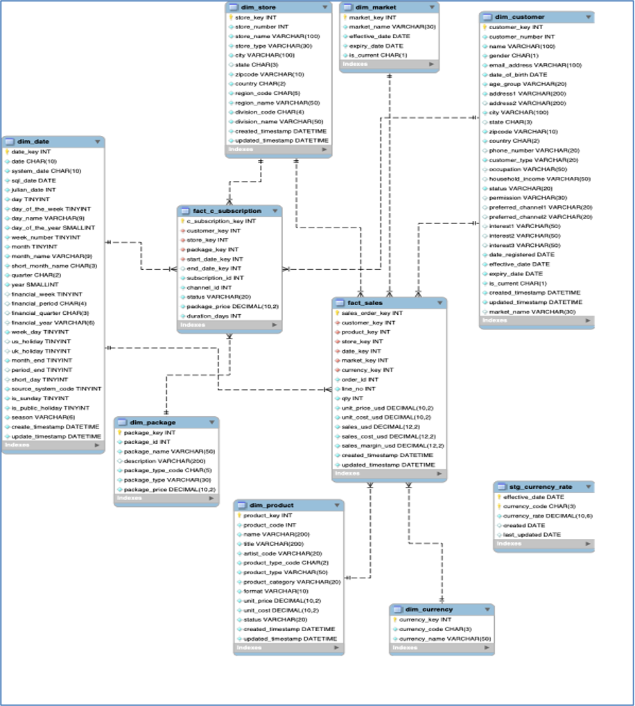
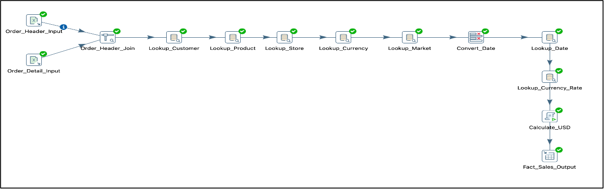
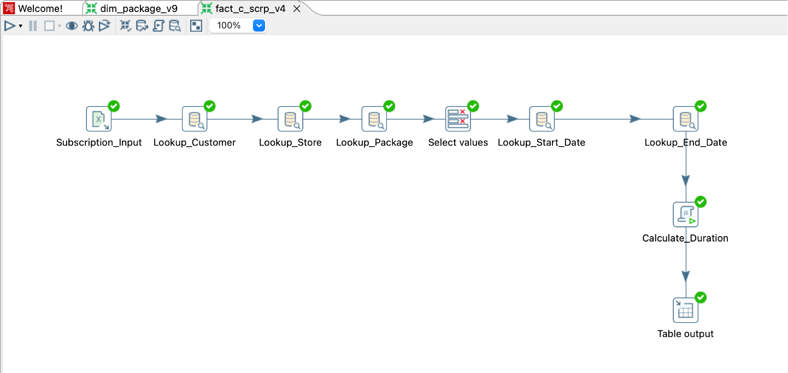
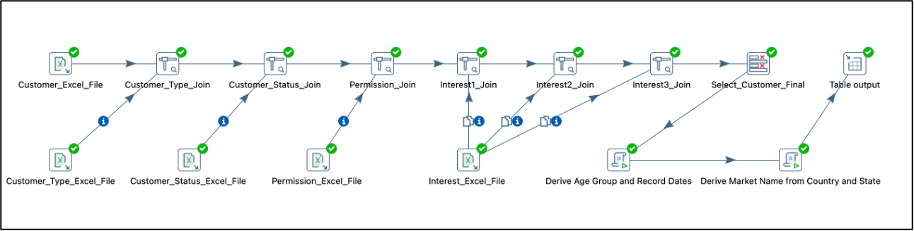
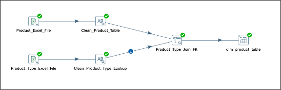
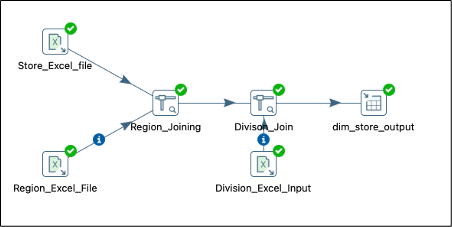
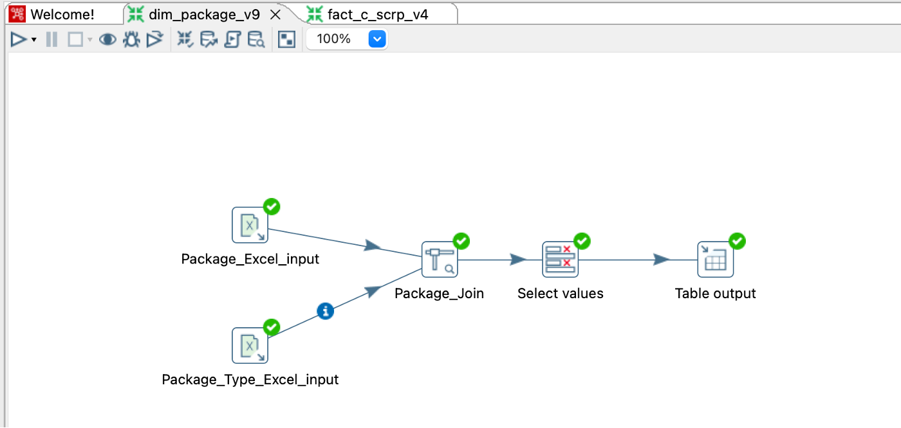
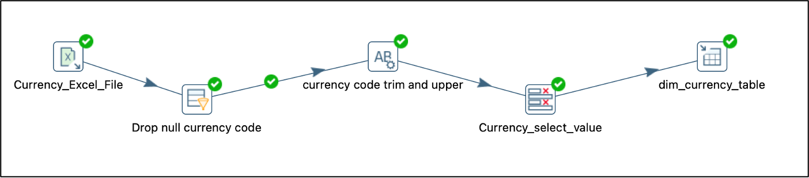
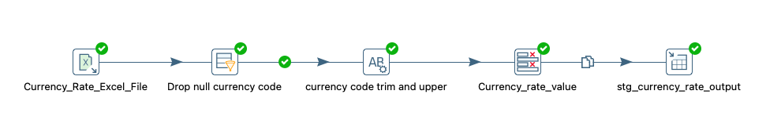

# ICE Entertainment — Dimensional Data Warehouse (Star Schema)

Star schema data warehouse for a global digital retailer, built with Pentaho (ETL) and a MySQL database. Integrates fragmented sales and ERP data into a single source of truth, with all financial reporting standardised to USD.

Developed as part of my postgraduate degree at Deakin University.

---

## Project Overview

ICE Entertainment's sales and operational data was fragmented across multiple source files and currencies, making consistent reporting difficult. The goal of this project was to consolidate that data into a well structured dimensional model that supports reliable, comparable business reporting.

The solution is a **star schema data warehouse** loaded through a set of Pentaho ETL pipelines, with a clear separation between raw staging, cleaned dimensions, and fact tables designed to be maintainable, re-runnable, and analytically sound.

---

## Design

- **Star schema:** 2 fact tables (`fact_sales`, `fact_c_subscription`) surrounded by conformed dimensions.
- **Dimensions:** `dim_customer` (SCD Type 2), `dim_product`, `dim_store`, `dim_market`, `dim_date` (Sunday flags + Australian public holidays 2022–2026), `dim_currency`.
- **ETL:** Pentaho transformations (`.ktr`) handle data cleansing, dimension lookups, monthly currency rate conversion to USD, and margin calculation.

---

## Key Technical Highlights

**SCD Type 2 on `dim_customer` ,preserving history, not just the latest state**

Customer attributes such as address and market change over time (for example, a customer relocating from one state to another). Rather than overwriting the old value, `dim_customer` uses Slowly Changing Dimension Type 2, expiring the previous record and inserting a new one, tracked with `effective_date`, `expiry_date`, and `is_current` flags.

This matters for accurate analysis: historical sales stay correctly attributed to the customer's address and market *at the time of purchase*, rather than being distorted by their current location. Without it, last year's sales for a relocated customer would be wrongly assigned to their new region, quietly corrupting any regional or market level analysis.

**Multi currency standardisation to USD**

Sales data arrives in multiple currencies, which makes cross market financial comparison impossible in raw form. A monthly currency rate lookup (`stg_currency_rate`) converts all financial figures to USD during the ETL, giving finance a single, comparable reporting standard across every market.

**Margin calculation built into the pipeline**

Unit cost and unit price are combined during the `fact_sales` load to calculate sales margin, so profitability is available directly in the warehouse, no downstream computation required by analysts.

**A dedicated `dim_date` for time intelligence**

Rather than relying on raw date fields, a purpose built date dimension encodes financial weeks/periods/quarters, day names, Sunday flags, and Australian public holidays (2022–2026). This lets the business slice sales by financial calendar and account for trading days and holidays, analysis that raw dates alone can't support.

---

## Data Flow / Architecture

The pipeline follows a layered design rather than loading everything in one step:

1. **Staging** — raw source files (Excel/CSV) are read in and lightly cleaned (null handling, trimming, standardising codes). Example: `stg_currency_rate` prepares the monthly rates before they're used downstream.
2. **Dimensions** — cleaned reference data is loaded into conformed dimension tables, with lookups resolving source codes into surrogate keys (e.g. joining region and division data into `dim_store`).
3. **Facts** — `fact_sales` and `fact_c_subscription` are loaded last, using dimension lookups to attach the correct foreign keys, convert currency to USD, and calculate derived measures like margin and subscription duration.

Separating cleaning (staging) from the final model (dimensions/facts) keeps the warehouse maintainable and makes individual transformations easy to re-run or debug.

---

## Star Schema (ER Diagram)

Two fact tables share a set of conformed dimensions, allowing sales and subscription data to be analysed against the same customers, stores, markets, and time periods.

---

## ETL Pipelines (Pentaho)

Each dimension and fact table is loaded by its own Pentaho transformation. Highlights below (see `images/` for the full set):

**`fact_sales` ETL** — joins order header and detail, resolves lookups for customer, product, store, currency, market, and date, converts values to USD via the currency-rate lookup, and calculates margin before loading.

**`fact_c_subscription` ETL**

**`dim_customer` — SCD Type 2**, multiple source files (customer type, status, permissions, interests) are joined, age group and record dates are derived, and market name is resolved from country and state before the SCD Type 2 load.

*(Additional pipelines for `dim_product`, `dim_store`, `dim_package`, `dim_currency`, and `stg_currency_rate` are included in `images/`.)*

**`dim_product` ETL**

**`dim_store` ETL**

**`dim_package` ETL**

**`dim_currency` ETL**

**`stg_currency_rate` ETL**

---

## Tech

Pentaho Data Integration (Spoon) · MySQL · SQL

---

## Files

- `*.ktr` — Pentaho transformations (open in Spoon to run)
- `*.sql` — schema creation scripts
- `images/` — ER diagram and key ETL pipeline screenshots

---

## About

Built by **Danny Chen**, a Master of Business Analytics candidate at Deakin University, specialising in Digital Finance and graduating in early 2027, as a portfolio piece demonstrating end to end data warehouse development, from dimensional modelling through ETL pipelines.

